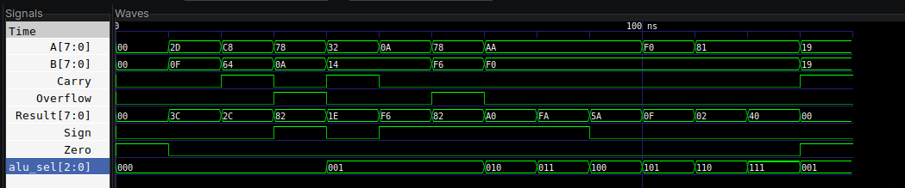

# Assignment 1: 8-bit ALU

In the first lab we implemented an 8-bit arithmetic logic unit using Verilog. The design performs arithmetic, bitwise, and shift operations on two 8-bit inputs and generates status flags for carry, zero, sign, and overflow.

## Supported Operations

The ALU uses `alu_sel[2:0]` to select the operation:

| `alu_sel` | Operation |
| --- | --- |
| `000` | Addition (`A + B`) |
| `001` | Subtraction (`A - B`) |
| `010` | Bitwise AND (`A & B`) |
| `011` | Bitwise OR (`A | B`) |
| `100` | Bitwise XOR (`A ^ B`) |
| `101` | Bitwise NOT (`~A`) |
| `110` | Shift left by 1 (`A << 1`) |
| `111` | Shift right by 1 (`A >> 1`) |

## Waveform Image

**Name:** Roshan Rijal

**Roll No:** 079BCT072